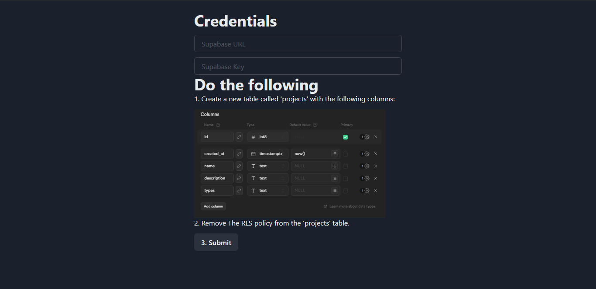
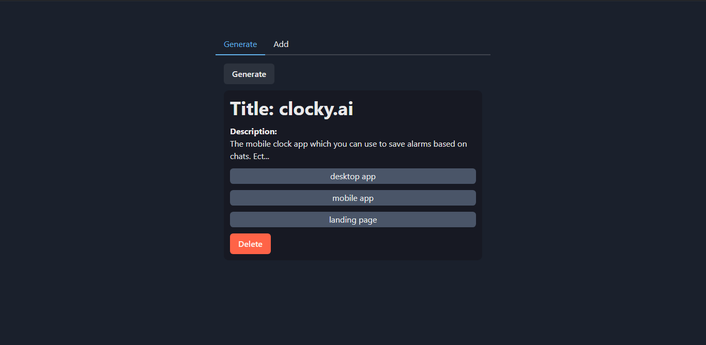
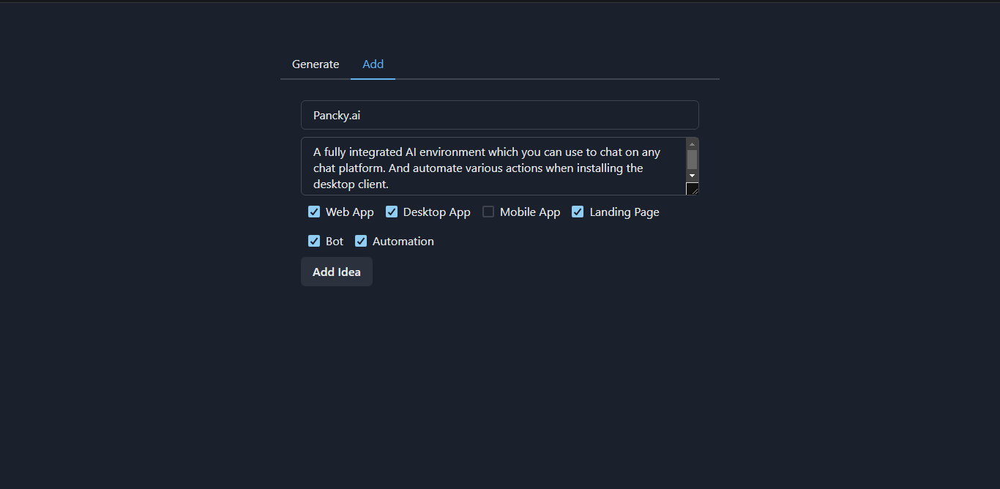

# Projy
A "project generator" project I made for myself in around 2 hours.

## Purpose
- Thinking of which idea you have to build can be hard. Hence I made it easy
- You just add your projects, click generate and build that one.
- I am using this for myself, And promise that this structure will make me 

## Showcase
Simple to signup, just Create a new supabase table called projects with the required keys, and copy the credentials to the app.

Choose A random Idea you have, And delete it if you have completed the project.

Add project ideas you come up with.

I will be adding all my projects ideas here, and using it to build my startup called https://syntactix.ai

## Tech Used:

 <a href="https://reactnative.dev/" target="_blank" rel="noreferrer"> 

